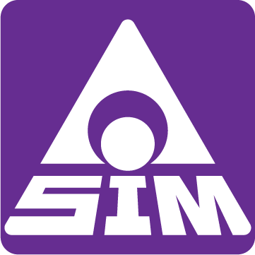

[English](./README.md)

  

# Semantic Isolation Method — 意味付分離法

**バイアスを観測し、不確実性を保持し、意味の境界を発見するための汎用的な意味論的思考法を定義する文書群です。**

Semantic Isolation Method（SIM／意味付分離法）は、差異、不確実性、観測者のバイアスを早急に解消することなく、意味について思考するための汎用的な方法です。

SIMは、AIのバイアスに対する問いから始まりました。知識、最適化、既存の文脈を利用するからこそ便利なシステムは、その利用者自身には元来なかった影響まで利用者へ返すことがあります。しかし、そのバイアスを排除しようとすると、別の問題が生じます。何をバイアスとし、何を中立あるいは正しいとするかを決めること自体が、すでに観測と解釈だからです。

そのためSIMは、バイアスを排除することから始めません。**観測そのものを観測可能にすること**から始めます。

> **観測者を観測する。**

この基礎の上でSIMは、差異を誤りとみなす前に情報として扱い、不確実性を明示的な状態として保持し、解釈・評価・実装によって意味が早急に収束される前に、意味の境界を分離します。

## 原典の構成

このリポジトリには、SIMの基礎を定義する原典文書を収録します。

| 巻 | タイトル | 役割 |
| --- | --- | --- |
| Prologue | **[SIMの起源と位置付け](./docs/ja/prologue.md)** | SIMがなぜ存在するのか、哲学・原理・方法がどのように関係するのかを示す |
| Vol. 1 | **[Meta-Observationalism — メタ観測主義論](./docs/ja/vol1-meta-observationalism.md)** | 哲学的基盤 |
| Vol. 2 | **[Reflexive Observation Principle — 再起観測原理](./docs/ja/vol2-reflexive-observation-principle.md)** | 対象と観測行為そのものをともに観測する原理 |
| Vol. 3 | **Basics of SIM — 意味付分離法の基礎** | 分野に依存しない意味論的思考法 |
| Vol. 4 | **SIM Reasoning Guidelines for AI — SIMによるAI思考ガイドライン** | SIMをAIの思考へ適用するための指針 |

英語版を原典（Canonical）とし、日本語版を公式翻訳とします。翻訳によって意味上の差異が生じた場合、その差異が明示的に解決されるまでは英語版を優先します。

## SIMと応用手法

SIMそのものは、ソフトウェア開発プロセス、ビジネス分析技法、アーキテクチャ手法、AIワークフローではありません。

それらは **Applied SIM（SIMの応用）** として派生させることができます。Applied SIMでは、この原典で定義された原理を基礎としながら、特定分野に必要な手順、成果物、役割、制約を導入できます。

AI支援ソフトウェア開発はSIMが最初に生まれた文脈ですが、それがSIMという方法の適用範囲を定義するものではありません。

## Version 0

SIMの基礎を定義する原典文書を **Version 0** とします。

Version 0は、予備版、不安定版、未完成版という意味ではありません。Applied SIMが派生する基礎層であることを示すための番号です。

歴史的には、この基礎が明示的に分離されるより先に、SIMの応用形が存在しました。Version 0は、それらの応用の下に存在していた原理を後から発見し、分離して記録するものです。

## ライセンス

このリポジトリの文書は **Creative Commons Attribution-NoDerivatives 4.0 International（CC BY-ND 4.0）** の下で提供します。

適切な帰属表示を行うことで、これらの文書を共有・引用できます。このライセンスの下では、改変した版を配布することはできません。

詳細は [LICENSE](./LICENSE) を参照してください。
